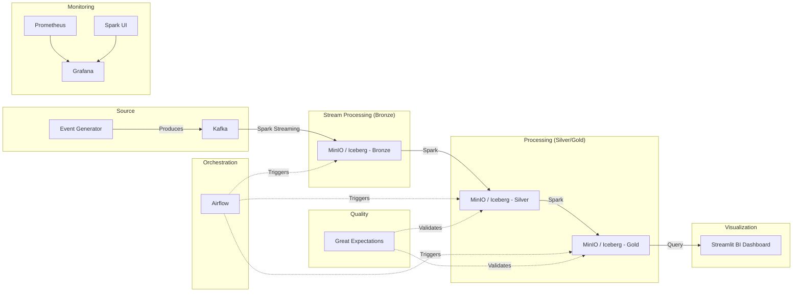

# E-commerce Event Pipeline Architecture

This project aims to build a modern, scalable data lakehouse using a Medallion Architecture (Bronze, Silver, Gold). It covers the full lifecycle of data from streaming ingestion to business-ready aggregates.

## Proposed Architecture

### 1. Data Flow & Components


### 2. Technology Stack
| Component | Technology | Rationale |
| :--- | :--- | :--- |
| **Ingestion** | Kafka | Industry standard for distributed streaming. |
| **Stream Processing**| PySpark (Structured Streaming) | Scalable, unified API for batch and stream. |
| **Storage (Object)** | MinIO | S3-compatible local storage. |
| **Table Format** | Apache Iceberg | Supports ACID, time travel, and schema evolution. |
| **Orchestration** | Apache Airflow | Robust workflow management. |
| **Data Quality** | Great Expectations | Declarative data validation. |
| **Infrastructure** | Docker Compose | Reproducible local development environment. |
| **Monitoring** | Grafana / Prometheus | Real-time observability. |
| **Visualization** | Streamlit | Python-based dashboard for BI insights. |

## Current Implementation Details
- **Kafka**: `ecommerce-kafka` (External: 29092, Internal: 9092)
- **MinIO**: `ecommerce-minio` (API: 9000, Console: 9001)
- **Spark**: `ecommerce-spark-master` (UI: 8080) / `ecommerce-spark-worker` (UI: 8081)
- **Airflow**: `ecommerce-airflow` (UI: 8082)

## Medallion Architecture Definition

1. **Bronze (Raw)**: Raw events directly from Kafka. Minimal transformation to preserve data lineage.
2. **Silver (Cleansed)**: Filtered, cleaned, and augmented data. Standardized schemas (e.g., proper timestamps, UUIDs).
3. **Gold (Curated)**: Business-level aggregates (e.g., Hourly Sales, Top Products, User Session Analysis). Ready for BI/Dashboarding.

## Project Structure
```text
ecommerce/
├── docker/                 # Docker Compose & Dockerfiles
├── src/
│   ├── generator/          # Python event generator
│   ├── streaming/          # Spark Streaming jobs
│   ├── batch/              # Spark Batch jobs
│   ├── quality/            # Great Expectations suites
│   └── utils/              # Common helpers
├── dags/                   # Airflow DAGs
├── scripts/                # Setup & utility scripts
└── tests/                  # Unit and integration tests
```

## Next Steps
1. **Confirmation**: Review and approve this architecture.
2. **Environment Setup**: Create `docker-compose.yml` to spin up Kafka, Spark, MinIO, and Airflow.
3. **Event Generator**: Build a Python script to simulate real-time e-commerce events.
4. **BI Layer**: Develop a Streamlit app to visualize trends from the Gold layer.

> [!IMPORTANT]
> Since we are building this locally, we will use Docker to simulate a distributed environment. Ensure you have Docker Desktop running.
